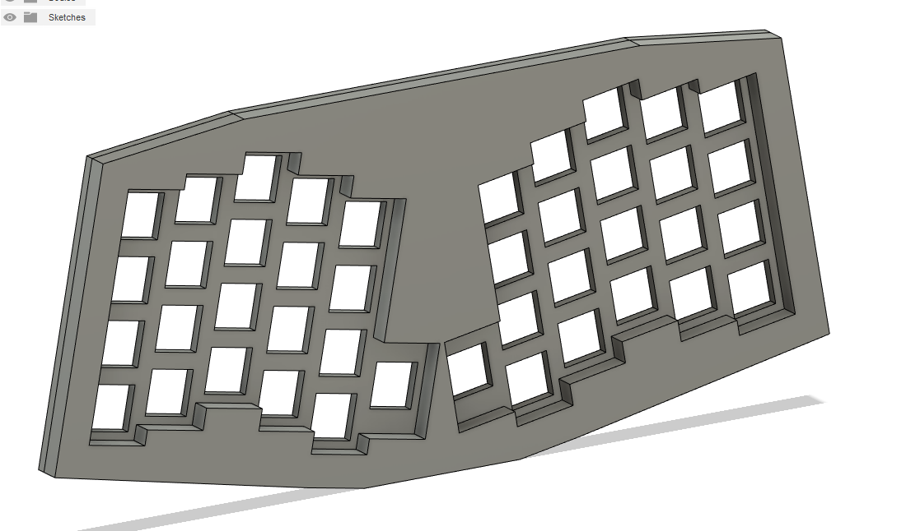
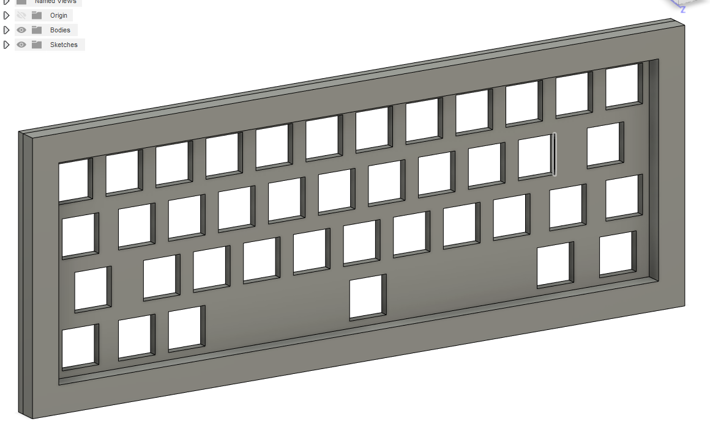

# Fusion360 Keyboard Generator

This is a Python script for [Autodesk Fusion 360](https://www.autodesk.com/products/fusion-360/overview) which will take a JSON file exported from [Keyboard Layout Editor (KLE)](http://www.keyboard-layout-editor.com), and construct a CAD model of the keyboard.

The intent is to automate the boilerplate steps of moving from KLE to a fleshed-out CAD model that can be used to create generic concept renders and animations.

Additionally, because the model is scripted within Fusion 360's non-destructive design timeline, it should be routine to go back and tweak the design parameters at any step in time to create a more advanced design than the generic default model.

The concept of the script is based on the [fusion360_scripts](https://github.com/misterkeebs/fusion360_scripts) library by Felipe Coury (AKA Mister Keebs). His scripts had the capability to position switches and keycaps based on a KLE JSON file, but was limited to layouts that didn't feature rotation.

## Installation

Copy the directory `KeebGen` into the corresponding script directory for your Fusion 360 installation. For example:

* **Windows** - `%appdata%\Autodesk\Autodesk Fusion 360\API\Scripts`

* **macOS** - `~/Library/Application Support/Autodesk/Autodesk Fusion 360/API/Scripts`

More information can be found in [the official Fusion 360 API documentation](https://help.autodesk.com/view/fusion360/ENU/?guid=GUID-A92A4B10-3781-4925-94C6-47DA85A4F65A).

## Usage

To run the script, launch Fusion 360 and within a design press `Shift + S` to open the script execution menu. Run `KeebGen.py` from the menu, and you should be prompted to select a KLE exported JSON file. Once you have selected your JSON file, the script will do its magic.

A number of sample JSON files have been included for testing in this repository, under the `sample-data` directory.

Here you can see a couple examples of models generated with the included sample-data KLE JSON files for the Atreus and JD40 keyboards:

## Features/Limitations/Known Issues

This script is currently in its very early stages of development. Its feature set is quite limited right now:

* Generate a plate from an arbitrary KLE
* Generate a matching bezel layer for the plate
* Shape the plate and bezel using an offset convex hull around the bezel

Due to an encoding issue, it's recommended that you don't try to use any unicode characters (including arrow symbols for example) in your KLE JSON file. There is a button in KLE settings to remove all legends.

## Upcoming work

* Position all switches at the appropriate location and orientation inside the switch plate.
* Position the corresponding keycap (including legend) if one exists in a selected keycap models directory.

## Recommended Resources

[Hineybush's Cherry-profile keycap models](https://github.com/hineybush/CherryMX)

[Cherry MX Switch Model](https://grabcad.com/library/cherry-mx-series-key-keycap-1)

[Keyboard Layout Editor (KLE)](http://www.keyboard-layout-editor.com)

## Contribution

I'm really excited that you want to extend or contribute to this script! If you make a new feature and want to merge it into this repo, feel free to shoot me a pull request. This repository is Free Software licensed under [GNU GPLv3](https://www.gnu.org/licenses/gpl-3.0.en.html).