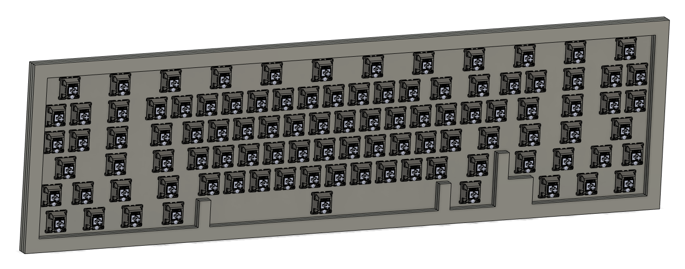

# Fusion360 Keyboard Generator

This is a Python script for [Autodesk Fusion 360](https://www.autodesk.com/products/fusion-360/overview) which will take a JSON file exported from [Keyboard Layout Editor (KLE)](http://www.keyboard-layout-editor.com), and construct a CAD model of the keyboard.

The intent is to automate the boilerplate steps of moving from KLE to a fleshed-out CAD model that can be used to create generic concept renders and animations.

Additionally, because the model is scripted within Fusion 360's non-destructive design timeline, it should be routine to go back and tweak the design parameters at any step in time to create a more advanced design than the generic default model.

The concept of the script is based on the [fusion360_scripts](https://github.com/misterkeebs/fusion360_scripts) library by Felipe Coury (AKA Mister Keebs). His scripts had the capability to position switches and keycaps based on a KLE JSON file, but was limited to layouts that didn't feature rotation.

## Installation

Copy the directory `KeebGen` into the corresponding script directory for your Fusion 360 installation. For example:

* **Windows** - `%appdata%\Autodesk\Autodesk Fusion 360\API\Scripts`

* **macOS** - `~/Library/Application Support/Autodesk/Autodesk Fusion 360/API/Scripts`

More information can be found in [the official Fusion 360 API documentation](https://help.autodesk.com/view/fusion360/ENU/?guid=GUID-A92A4B10-3781-4925-94C6-47DA85A4F65A).

## Usage

The current implementation will generate a simplified layered acrylic case design. The parameters of the case are configurable in the [Config file](KeebGen/Modules/Config/__init__.py)

In addition to the case parameters, you can turn on switch model insertion by setting the config parameter `INSERT_SWITCHES = True`.

To run the script, launch Fusion 360 and within a design press `Shift + S` to open the script execution menu. Run `KeebGen.py` from the menu, and you should be prompted to select a KLE exported JSON file. Once you have selected your JSON file, the script will do its magic. If you've set `INSERT_SWITCHES = True`, you will also be prompted for a switch model file.

A number of sample JSON files have been included for testing in this repository, under the `sample-data` directory.

Here you can see a couple examples of models generated with the included sample-data KLE JSON files for the Atreus, OG Space Cadet, and JD40 keyboard layouts:

## Limitations/Known Issues

Due to an encoding issue, it's recommended that you don't try to use any unicode characters (including arrow symbols for example) in your KLE JSON file. There is a button in KLE settings to remove all legends.

## Upcoming work

* Fix the JSON encoding issue that causes KLEs with unicode characters (like arrow symbols) to crash
* Position the corresponding keycap (including legend) if one exists in a selected keycap models directory.
* Add screw holes and USB cutout to case

## Recommended Resources

[Hineybush's Cherry-profile keycap models](https://github.com/hineybush/CherryMX)

[Cherry MX Switch Model](https://grabcad.com/library/cherry-mx-series-key-keycap-1)

[Keyboard Layout Editor (KLE)](http://www.keyboard-layout-editor.com)

## Contribution
All original code in this repository is Free Software licensed under [GNU GPLv3](https://www.gnu.org/licenses/gpl-3.0.en.html).

I'd be really stoked if anyone wants to extend or contribute to this script! If you make a new feature and want to merge it into this repo, feel free to shoot me a pull request. 

The sample-data folder is only for use as test data for developing software and is not intended to confer any license or rights to use the respective keyboard layouts in commercial products.

Please respect the designers who spend countless hours developing and iterating on their keyboard ideas: support the original designers, don't buy clones, and don't use this software to make evil ripoff cases!